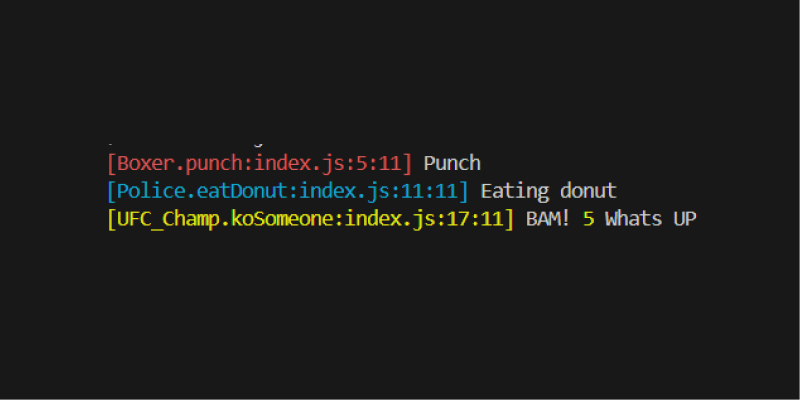

# kruza



##
[Class.Method:location]

Kruza is a utility that traces class methods and code locations. It makes logging easier with color-coded outputs that help identify where logs come from.

## Contributing

If you have ideas for making logging operations even easier, feel free to submit a pull request on GitHub. Contributions are always welcome!

## Installation

To install kruza, use npm or yarn:

```bash
npm install kruza
```

or

```bash
yarn add kruza
```

## Usage

Kruza provides a simple way to log messages from different parts of your application. Below are some examples that demonstrate how you can use the utility to enhance your logging.

### Importing kruza

You can import kruza using ES Modules:

```javascript
import _ from "kruza";
```

Make sure your package.json has

```javascript
"type": "module"
```

Or if you are using CommonJS:

```javascript
const _ = require("kruza");
```

### Logging Example

Here is an example of using `kruza`'s logging capabilities to demonstrate different features:

```javascript
import _ from "kruza";

class Boxer {
  punch() {
    _.log("Punch");
  }
}

class Police {
  eatDonut() {
    _.log("Eating donut");
  }
}

class UFC_Champ {
  koSomeone() {
    _.log("BAM!");
  }
}

const b = new Boxer();
b.punch(); // Output: [Boxer.punch] Punch

const p = new Police();
p.eatDonut(); // Output: [Police.eatDonut] Eating donut

const ufc = new UFC_Champ();
ufc.koSomeone(); // Output: [UFC_Champ.koSomeone] BAM!
```

### Handling Logs with Different Sources

Kruza logs messages with the class, method name, and code location, making it easy to see where messages come from.

For example:

- `[Boxer.punch] Punch`
- `[Police.eatDonut] Eating donut`
- `[UFC_Champ.koSomeone] BAM!`

This makes it easy to identify logs visually, especially when multiple parts of your application are generating logs simultaneously.

## License

Kruza is licensed under the **MIT License**. See the [LICENSE](./LICENSE) file for more details.

## Publishing

To publish a new version of kruza, run the following commands:

```bash
npm run build
npm publish
```